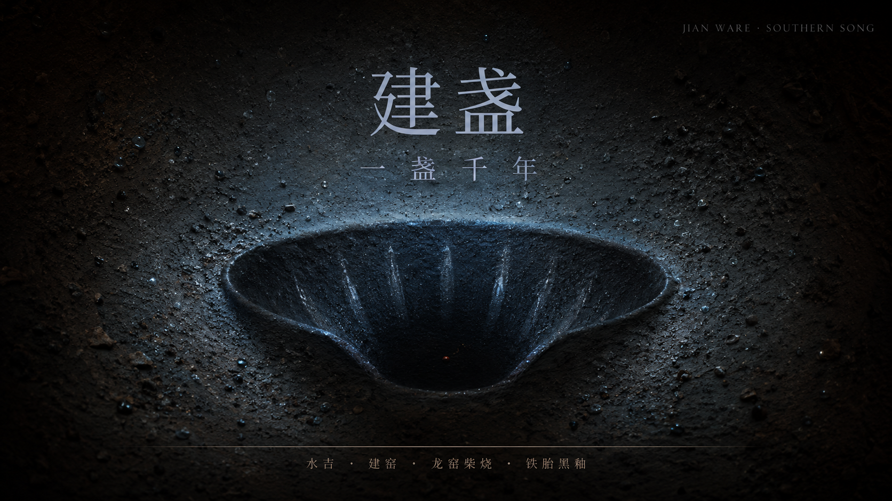
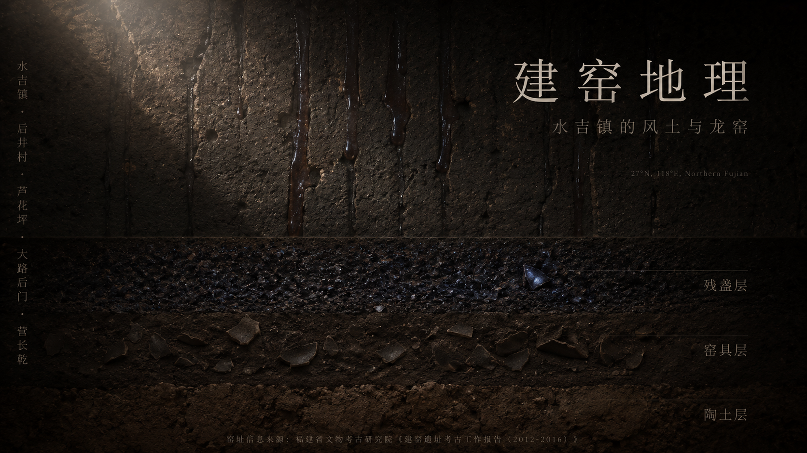
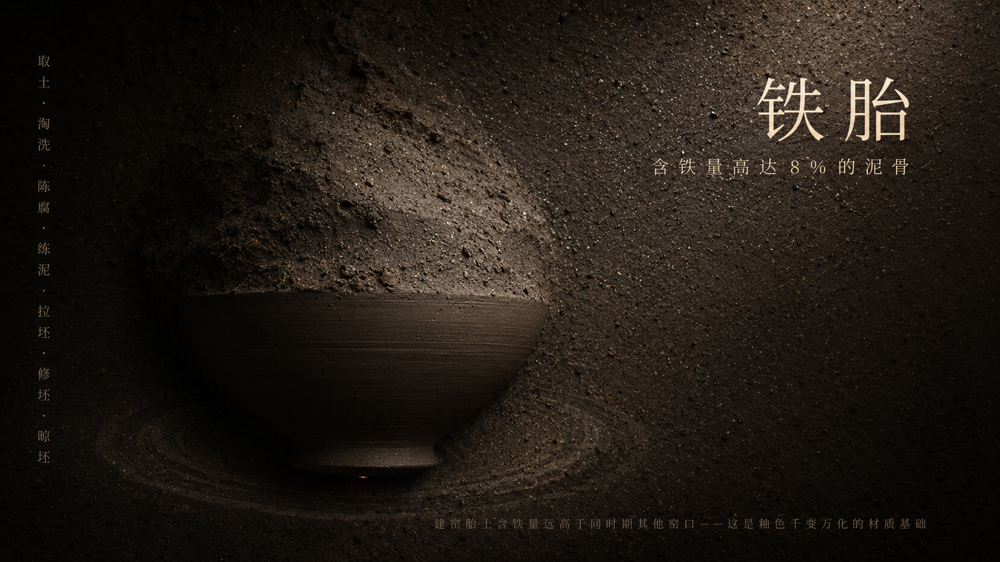
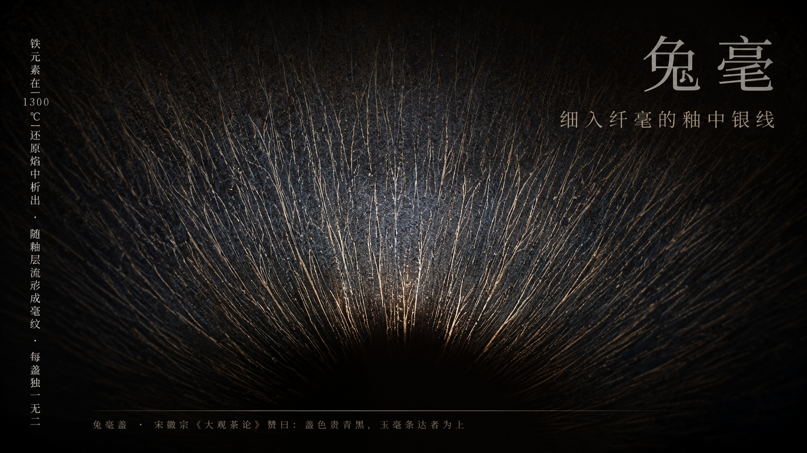
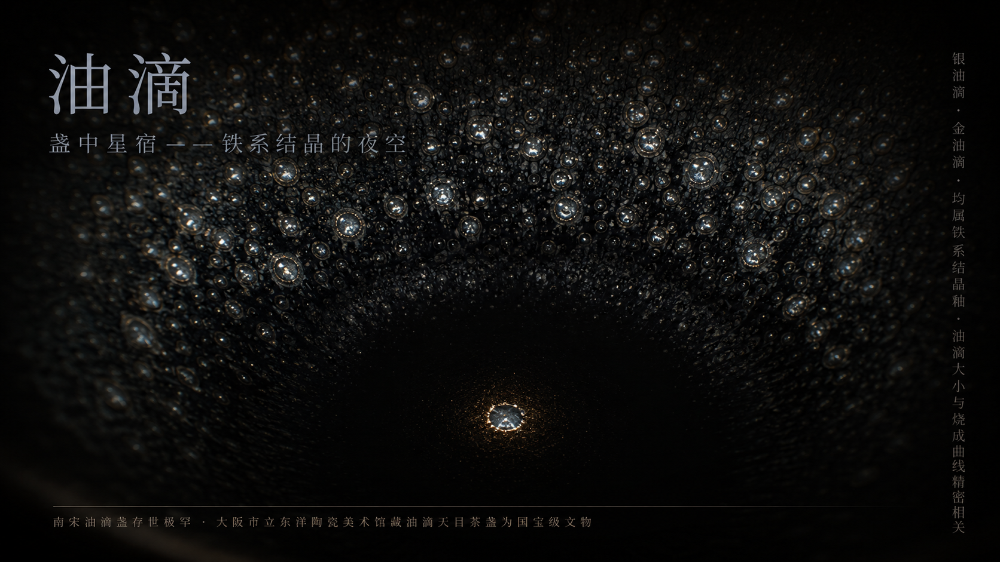
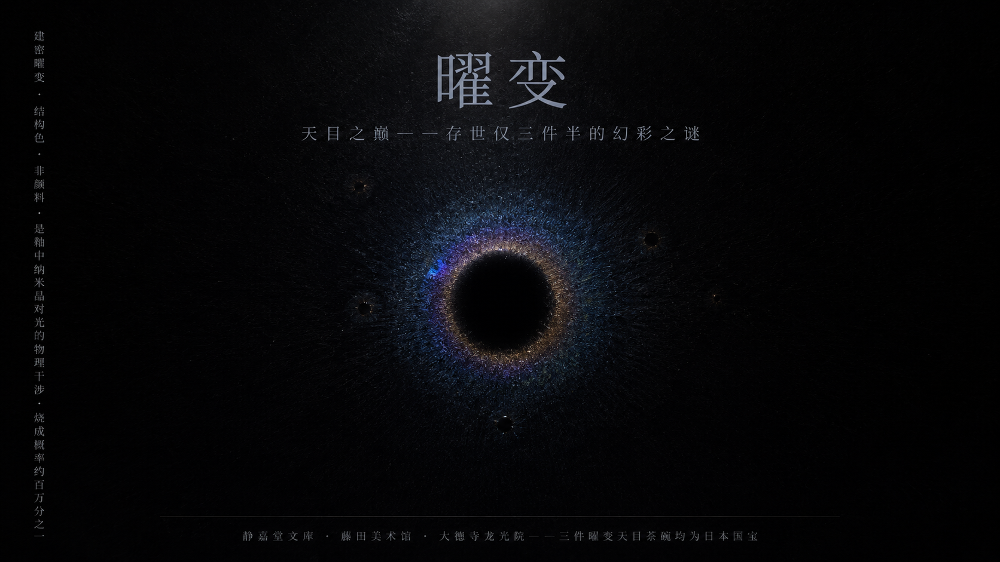
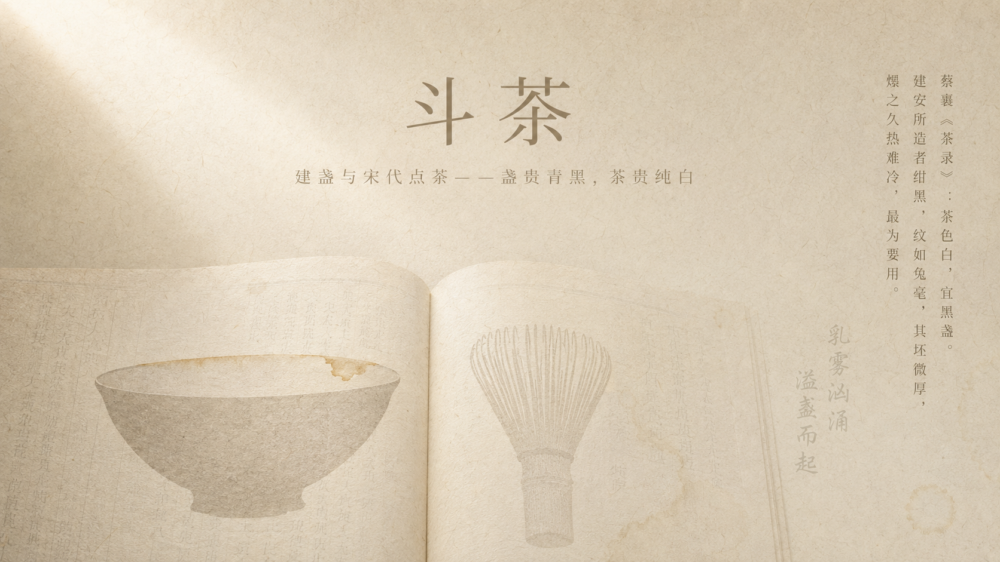
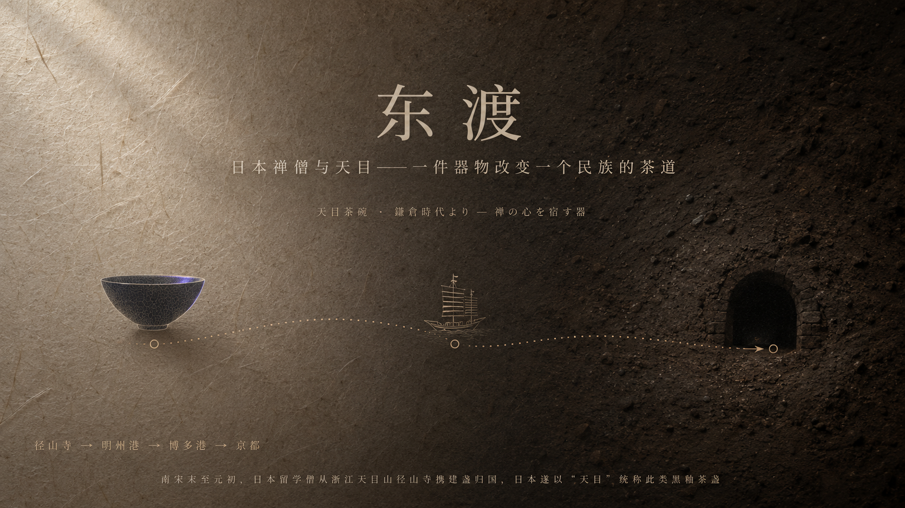
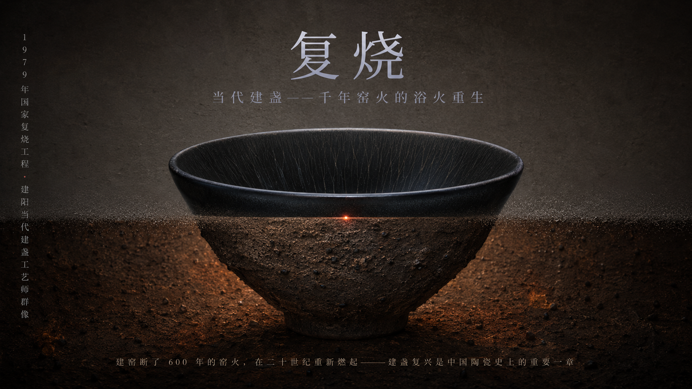

# 宋韵沉静美学PPT · Songyun Quiet Aesthetics PPT

> **一句话介绍**：一个让AI帮你生成"沉静显影"美学风格PPT视觉提示词的技能。画面不靠清晰物件抢夺注意，而让主体像从温润、被时间浸泡过的材质中慢慢浮现。

---

## 什么是这个技能？

这是一个 **WorkBuddy / ChatGPT / Claude / Coze / Cursor** 等AI工具通用的 **SKILL.md** 技能文件。

- **不直接出图** —— 它生成的是可以直接复制到 **GPTImage 2.0** 的完整中文提示词
- **全部中文描述** —— GPTImage 2.0 对中文提示词理解度极高
- **16:9 横版比例** —— 符合PPT宽屏标准
- **每页独立** —— 10页就是10段独立提示词，可单独调整、替换或重新生成

核心美学理念：**沉静显影**（Quiet Revelation）——绢底、纸纹、漆面、陶土或香云肌理作为承载层，中心被克制的漫射光托出，文字是主要造型力量。

---

## 作品展示 · 建盏（10页PPT）

以下为使用本技能生成的「建盏」主题10页PPT，由GPTImage 2.0出图：

### 第1页 · 封面 · 一盏千年
> 建盏轮廓从匣钵陶土中浮出，窑变铜红点睛



### 第2页 · 建窑地理 · 水吉镇的风土
> 龙窑窑壁釉泪 + 窑址地层断面



### 第3页 · 铁胎 · 建盏的泥骨
> 含铁胎土 + 辘轳拉坯幻影



### 第4页 · 兔毫 · 细入纤毫的釉中银线
> 兔毫纹微距，银线向盏心汇聚



### 第5页 · 油滴 · 盏中的星宿图谱
> 油滴星阵 + 盏心孤星如北极星



### 第6页 · 曜变 · 天目之巅的幻彩之谜
> 结构色虹彩，纳米晶光的物理干涉



### 第7页 · 斗茶 · 建盏与宋代点茶
> 宋版茶书 + 盏中茶渍残迹



### 第8页 · 东渡 · 禅僧与天目
> 和纸×陶土双材质，海上航线意象



### 第9页 · 复烧 · 当代建盏的浴火重生
> 古龙窑×电窑双材质，双时态盏形重叠



### 第10页 · 封底 · 盏中宇宙
> 盏底水渍 + 极致留白


---

## 安装方法

### 方式一：WorkBuddy用户（推荐）

```bash
# 1. 下载本仓库的 zip 或 clone
# 2. 解压到 WorkBuddy 的 skills 目录
cd ~/.workbuddy/skills

# 3. 将 SONGPPT 文件夹放入（确保目录名为 宋韵沉静美学PPT）
# 最终路径：~/.workbuddy/skills/宋韵沉静美学PPT/SKILL.md

# 4. 重启 WorkBuddy 或刷新技能列表
# 5. 说触发词即可使用
```

### 方式二：ChatGPT / Claude / Coze / Cursor 用户

直接复制 `SKILL.md` 文件中的内容，作为 **Custom Instructions**（自定义指令）或 **System Prompt** 粘贴到你的AI工具中即可使用。

---

## 使用方法

装好之后，只需说触发词，比如：

```
宋韵PPT，主题：建盏，10页
```

或自定义章节：

```
宋韵PPT，我自己定章节：
1. 封面 · 建盏
2. 窑变之谜
3. 兔毫与油滴
4. 曜变天目
5. 斗茶之风
6. 建盏与禅
7. 东渡日本
8. 当代复烧
9. 收藏与鉴赏
10. 封底 · 盏中宇宙
```

技能会自动：
1. 确认章节规划
2. 生成每页的完整中文提示词
3. 提示词直接复制到 GPTImage 2.0 出图

---

## 触发词列表

以下任一词语均可触发本技能：

- `宋韵PPT`（最常用）
- `沉静显影`
- `沉静美学`
- `文人美学PPT`
- `书香PPT`
- `文人气`
- `知识课件`
- `文化报告`
- `宋风设计`
- `古器物美学`

---

## 适用主题

本技能最适合以下类型的传统文化主题：

| 主题类型 | 示例 |
|----------|------|
| 陶瓷工艺 | 建盏、青白瓷、汝窑、哥窑 |
| 茶道香道 | 宋代点茶、沉香、合香 |
| 非遗工艺 | 漆器、缂丝、篆刻、金缮 |
| 书画典籍 | 书法、宋版书、碑帖 |
| 节气饮食 | 二十四节气、本草、文人食单 |
| 建筑园林 | 宋式营造、园林美学 |

---

## 视觉美学体系

### 材质承载层

画面底层不是空白画布，而是一块**被时间浸泡过的可触摸材质**：

| 主题类型 | 推荐肌理 |
|----------|----------|
| 香道、茶道、器物 | 古绢纹理、旧纸纤维、漆面微光 |
| 陶瓷、工艺、非遗 | 陶土颗粒、釉面酥光、窑变肌理 |
| 书画、版本、典籍 | 楮皮纸纹、墨渍渗透、虫蛀痕迹 |
| 建筑、园林、空间 | 旧木年轮、石面粉化、苔痕斑驳 |

### 光影逻辑

中心区域受一束**克制的漫射光**托出——如同月光透过窗纸、灯下观旧画、隔纱见远山。光不是打上去的，而是从材质内部渗出来的。

### 文字造型

- **中文标题**：细长清瘦、带呼吸感的宋体，字距略松，行距留出空气
- **英文/数字**：更轻的衬线体或窄体字，作为节奏停顿和旁注
- **禁忌**：不做可爱图标、不堆叠装饰元素、不用纯黑纯白硬切

---

## 技术规格

| 项目 | 说明 |
|------|------|
| 输出比例 | 16:9（PPT宽屏标准） |
| 输出语言 | 全中文提示词 |
| AI绘图工具 | GPTImage 2.0（推荐） |
| 最少页数 | 10页（含封面+封底） |
| 章节规划 | 支持自动规划或用户自定义 |

---

## 作者

- **作者**：KK（ansuelele）
- **个人网站**：[kkagi.net](https://kkagi.net)
- **相关项目**：
  - [PORTAILOGO](https://github.com/ansuelele/PORTAILOGO) — 人像肖像品牌字标Logo
  - [GUOCHAOLOGO](https://github.com/ansuelele/GUOCHAOLOGO) — 国风美食角色徽章Logo
  - [leijun-works](https://github.com/ansuelele/leijun-works) — 雷军风格写作技能

---

## 许可证

MIT License — 可自由使用、修改、分享。

---

> *"一盏空盏盛着宇宙，一张白纸收着所有。"*
